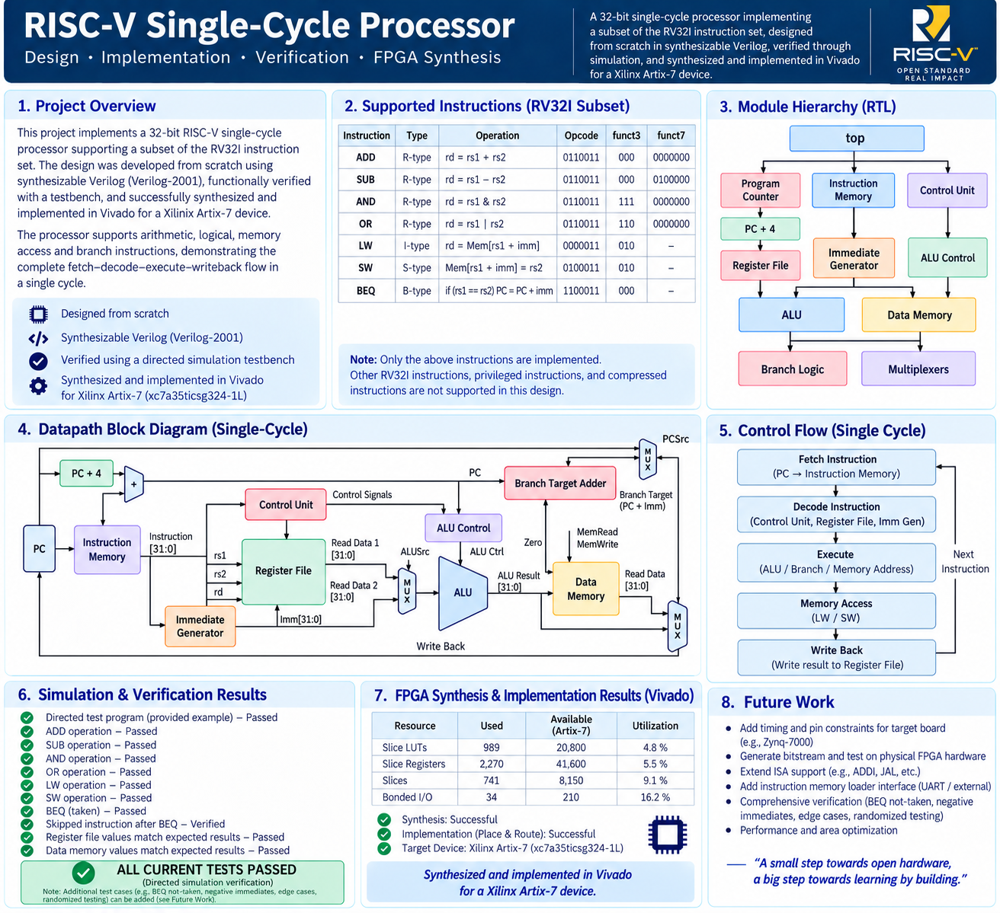

# RISC-V Single-Cycle Processor in Verilog

A 32-bit RISC-V single-cycle processor implemented in synthesizable Verilog-2001, supporting a focused RV32I instruction subset with arithmetic, logical, memory-access, and conditional-branch operations.

## Project Overview

This project implements a 32-bit RISC-V single-cycle processor using Verilog-2001.

The processor follows a modular datapath architecture containing a program counter, instruction memory, register file, immediate generator, control unit, ALU control, ALU, data memory, branch logic, and multiplexers.

The current implementation supports exactly seven instructions:

- `ADD`
- `SUB`
- `AND`
- `OR`
- `LW`
- `SW`
- `BEQ`

The design was functionally verified using a directed Verilog simulation testbench and was synthesized for a Xilinx Artix-7 FPGA target.

---

## Key Features

- 32-bit RISC-V single-cycle processor
- Verilog-2001 RTL implementation
- Focused RV32I instruction subset
- Modular datapath and control architecture
- 32-register register file
- RISC-V `x0` behavior
- Arithmetic and logical ALU operations
- Load/store memory interface
- BEQ conditional branch mechanism
- Separate instruction and data memories
- Directed functional simulation testbench
- FPGA synthesis and resource utilization analysis

---

## Supported Instructions

| Instruction | Type | Operation |
|-------------|------|-----------|
| `ADD` | R-type | `rd = rs1 + rs2` |
| `SUB` | R-type | `rd = rs1 - rs2` |
| `AND` | R-type | `rd = rs1 & rs2` |
| `OR` | R-type | `rd = rs1 \| rs2` |
| `LW` | I-type | `rd = Mem[rs1 + imm]` |
| `SW` | S-type | `Mem[rs1 + imm] = rs2` |
| `BEQ` | B-type | Branch if `rs1 == rs2` |

Only the instructions listed above are implemented in the current RTL.

---

## Architecture Overview

The processor uses a single-cycle datapath in which the required instruction operations are completed within one clock cycle.



### Main Datapath Components

- Program Counter
- PC + 4 logic
- Instruction Memory
- Register File
- Immediate Generator
- Control Unit
- ALU Control
- ALU
- Branch Target Adder
- Branch Decision Logic
- Data Memory
- Multiplexers
- Write-back path

---

## Main RTL Modules

### `Program_Counter`

Stores the current program counter and updates it on the rising edge of the clock. The PC is reset to zero.

### `PCplus4`

Generates the sequential next instruction address:

```text
PC + 4